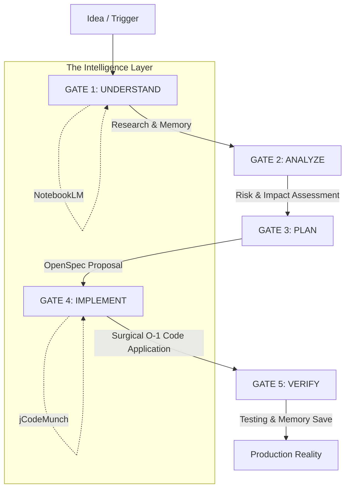

# 🌌 Antigravity Power: The Sovereign Engine of Creation

<p align="center">
  
</p>

<h2 align="center">The Ultimate Agentic Development Suite</h2>

<p align="center">
  <strong>Flawless project lifecycle management from inception to deployment.</strong>
</p>

<p align="center">
  <a href="#-the-four-pillars">Pillars of Power</a> •
  <a href="#-the-flawless-workflow">The Flawless Cycle</a> •
  <a href="#-ecosystem-components">Components</a> •
  <a href="#-quick-start">Summoning Guide</a>
</p>

---

## ✨ The Vision

**Antigravity Power** is not merely a tool—it is the convergence of elite account management, specialized agentic intelligence, and disciplined workflow engineering. By unifying the **Manager**, **Skills**, **Workflows**, and **Project Engine**, we provide a sovereign environment where ideas transition into production-grade reality without friction.

---

## 🏛️ The Four Pillars

| Pillar | Essence | Key Capability |
| :--- | :--- | :--- |
| **The Navigator** | [Antigravity Manager](./AntigravityManager) | Infinite account pools, smart auto-switching, and local API proxies. |
| **The Library** | [Awesome Skills](./antigravity-awesome-skills-main) | 1,500+ specialized playbooks for architecture, coding, and security. |
| **The Master Plan** | [Workflows](./antigravity-workflows) | Stack-agnostic, question-driven processes that adapt to your intent. |
| **The Engine** | [Project Starter](./antigravity-project-starter) | 5-Gate OpenSpec development fueled by O(1) AST intelligence. |

---

## 🔄 The Flawless Workflow (5-Gate OpenSpec)

Our ecosystem enforces a disciplined, spec-driven development cycle that ensures quality at every layer.



---

## 📦 Ecosystem Components

### 🛡️ Antigravity Manager
Professional desktop suite for managing Google Gemini & Claude accounts.
- **Smart Switching**: Never hit a rate limit again; the manager rotates accounts automatically.
- **Local Proxy**: OpenAI/Anthropic compatible local server for all your development tools.

### 📚 Antigravity Skills & Awesome Skills
A massive, installable library of `SKILL.md` definitions.
- **Breadth**: 1,459+ skills covering Full-Stack, DevOps, Security, and Product Management.
- **Bundles**: Role-based starter packs (Web Wizard, Security Engineer, etc.).

### 🚀 Antigravity Workflows
Intelligent scripts that teach the AI *how* to perform tasks.
- **Stack-Agnostic**: Works with any framework (React, Vue, Go, Rust, etc.).
- **Question-Driven**: The AI asks the right questions before touching your code.

### ⚙️ Antigravity Project Starter
The high-performance core for large-scale codebases.
- **jCodeMunch**: O(1) codebase retrieval—query symbols instead of reading files (saves 99% tokens).
- **Continuity**: Persistent project memory and session tracking.

---

## ⚡ Quick Start

### 1. Initialize the Sanctum
The fastest way to empower your current workspace is via the Awesome Skills installer:

```bash
# Default installation to ~/.gemini/antigravity/skills
npx antigravity-awesome-skills
```

### 2. Scaffold a New Reality
To start a project using the full 5-Gate OpenSpec Engine:

```bash
# Navigate to your new project root
npx antigravity-project-starter init
```

### 3. Summon the Manager
Download the [Antigravity Manager](./AntigravityManager) binary to handle your account pools and API proxies.

---

## 🤝 Contributing to the Power

We stand on the shoulders of giants. Contributions to any sub-realm (Skills, Workflows, or Manager) are welcome. Please refer to the specific `CONTRIBUTING.md` in each subdirectory.

---

<p align="center">
  <em>Build faster. Build smarter. Defy gravity.</em><br>
  <strong>Made with ❤️ for the Antigravity Community</strong>
</p>
